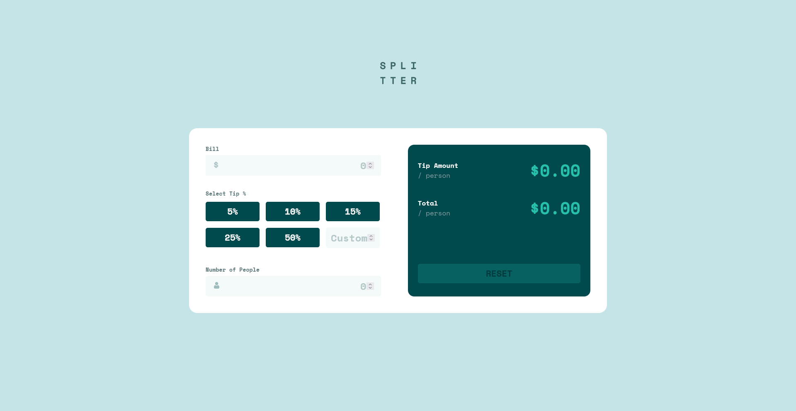
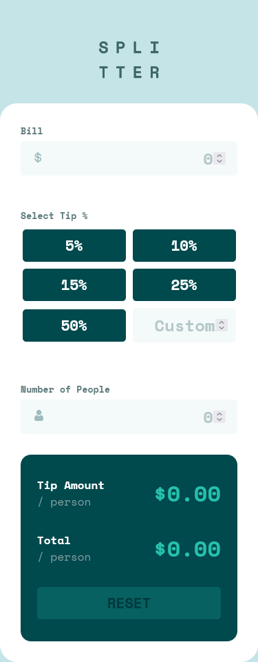

# Frontend Mentor - Tip calculator app solution

This is a solution to the [Tip calculator app challenge on Frontend Mentor](https://www.frontendmentor.io/challenges/tip-calculator-app-ugJNGbJUX). Frontend Mentor challenges help you improve your coding skills by building realistic projects.

## Table of contents

- [Overview](#overview)
    - [The challenge](#the-challenge)
    - [Screenshot](#screenshot)
    - [Links](#links)
- [My process](#my-process)
    - [Built with](#built-with)
- [Author](#author)

## Overview

### The challenge

Users should be able to:

- View the optimal layout for the app depending on their device's screen size
- See hover states for all interactive elements on the page
- Calculate the correct tip and total cost of the bill per person

### Screenshot

### Links

- Solution URL: [Solution](https://your-solution-url.com)
- Live Site URL: [Live Site](https://elastic-blackwell-c4a971.netlify.app/)

## My process

### Built with

- React
- Styled Components
- TypeScript
- Flexbox
- Mobile-first workflow
- [React](https://reactjs.org/) - JS library
- [Styled Components](https://styled-components.com/) - For styles
- [TypeScript](https://www.typescriptlang.org/) - For types

## Author

- Website - [Bartosz Fórmanowski](https://bartoszformanowski.me/home)
- Frontend Mentor - [@BartekFo](https://www.frontendmentor.io/profile/BartekFo)
- Twitter - [@Bartosz_For](https://twitter.com/Bartosz_For)
